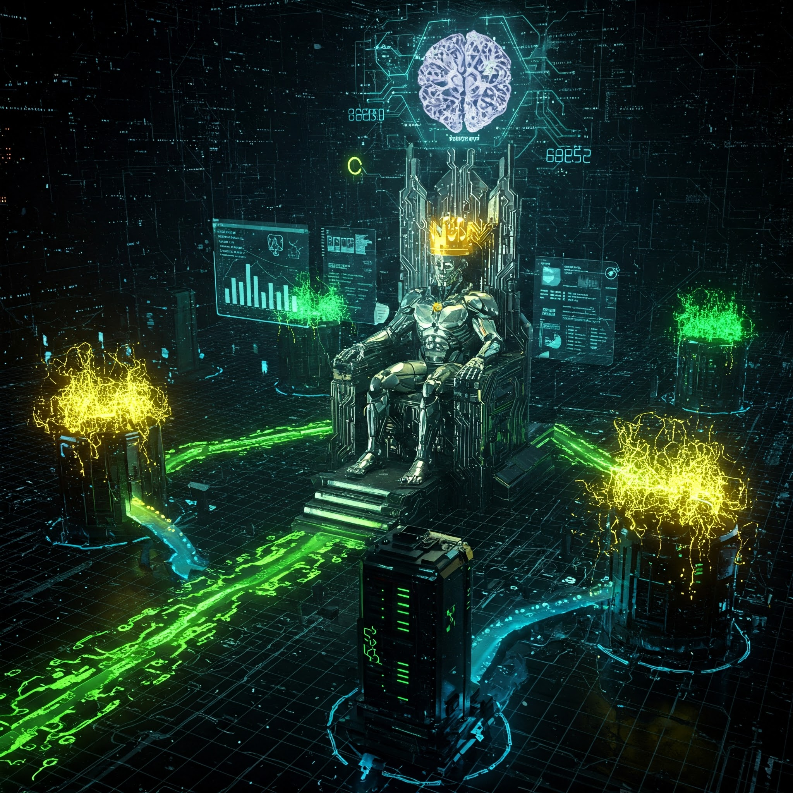

<p align="center">
	
</p>

# NeuraBalancer: Self-Optimizing Load Balancer

An AI-driven load balancing system that uses machine learning to optimize request routing based on server health, request complexity, and predicted response times.

## 🚀 Quick Start

### Prerequisites
- Go 1.18+
- Python 3.8+ (for ML components)
- ONNX Runtime 1.21.0 (specifically onnxruntime-win-x64-1.21.0 for Windows)
- Docker and Docker Compose (optional for containerized setup)
- Kubernetes (optional for K8s deployment)
- PowerShell (for Windows users running task commands)

### Setting Up Environment Variables
Create or modify `.env` file in the root directory with the following configuration:

```plaintext
# Application Port
PORT=8080

# PostgreSQL Database Credentials
DB_HOST=localhost
DB_SSLMODE=disable
DB_CONTAINER_NAME=neura_db
DB_NAME=neura_balancer
DB_USER=myuser
DB_PASSWORD=mypassword
DB_PORT=5433

# General Backend Config
APP_ENV=development
LOG_LEVEL=info

# Load Balancing Strategy Selection
# Options: least_connections, round_robin, weighted_round_robin, random, ml
LB_STRATEGY=ml

# Server List
SERVERS=http://localhost:5000,http://localhost:5001,http://localhost:5002

# Weights for Weighted Round Robin Strategy
SERVER_5000_WEIGHT=2
SERVER_5001_WEIGHT=1
SERVER_5002_WEIGHT=3

# ML Model Endpoint (used if LB_STRATEGY=ml)
ML_MODEL_ENDPOINT=http://ml-service:8000
```

### Install Dependencies

#### Backend Dependencies
```bash
go mod download
```

#### ML Dependencies
```bash
pip install -r ml/training/requirements.txt
pip install onnxruntime-win-x64==1.21.0  # For Windows
# For other platforms, use the appropriate ONNX runtime package
```

## 🛠 Starting the Server

### Option 1: Start Everything at Once
```bash
# Start the entire system (backend servers + load balancer)
task start-all
```

### Option 2: Start with ML Components
```bash
# Start everything including ML components
task start-ml-all
```

### Option 3: Component-by-Component

#### First terminal - Start backend servers
```bash
task start-servers
```

#### Second terminal - Start ML model server
```bash
task ml-serve-local
```

#### Third terminal - Run load balancer with ML
```bash
task run-balancer-ml
```

## 🧪 Testing

### Test ML Integration Flow
```bash
task test-ml-flow
```

This task will:
1. Kill any processes using the required ports
2. Start the backend servers
3. Start the ML model server
4. Run the load balancer with ML strategy
5. Test the health endpoints
6. Generate load with 100 requests
7. Check metrics

## 📊 Monitoring & Logs

### Log Files
All logs are stored in the `logs/` directory:

- `balancer.log` - Main load balancer logs
- `balancer-run.log` - Runtime logs for the load balancer
- `balancer-ml.log` - ML-specific logs
- `server5000.log`, `server5001.log`, `server5002.log` - Individual server logs
- `cleanup.log` - Port cleanup logs

### Accessing Metrics
- Grafana Dashboard: `http://localhost:3000`
- Prometheus Metrics: `http://localhost:9090/targets`
- Load Balancer Metrics: `http://localhost:8080/metrics`

## 🐳 Docker Support

```bash
# Build Docker image
task docker-build

# Run in Docker
task docker-run

# Clean up Docker containers
task docker-clean
```

## ☸️ Kubernetes Deployment

```bash
# Deploy to Kubernetes
task k8s-deploy

# Check status
task k8s-status

# View logs
task k8s-logs
```

## 💾 Database Management

```bash
# Run database migrations
task db-migrate

# Reset database (delete & recreate tables)
task db-reset
```

## 🧹 Cleanup

```bash
# Kill all running servers
task kill-servers

# Clean up ports
task kill-ports

# Remove binaries and artifacts
task clean
```

## 📘 Detailed Documentation
For in-depth information about system architecture, component details, and theory behind the ML-based load balancing, please see [DOCUMENTATION.md](documentation/DOCUMENTATION.md).

## 📌 API Endpoints

| **Method** | **Endpoint**     | **Description**                          |
|------------|------------------|------------------------------------------|
| `GET`      | `/api/health`    | Health check for load balancer           |
| `POST`     | `/api/route`     | Routes request to best server            |
| `GET`      | `/api/metrics`   | Fetches current server stats             |
| `POST`     | `/api/predict`   | Predicts best server based on metrics    |

## 🤝 Contributing

1. Fork the repository
2. Create a feature branch
3. Commit your changes
4. Push to the branch
5. Create a Pull Request

**Important**: Please keep your pull requests small and focused. This will make it easier to review and merge.

## 💡 Feature Requests

If you have a feature request, please open an issue and make sure it is tagged with `enhancement`.